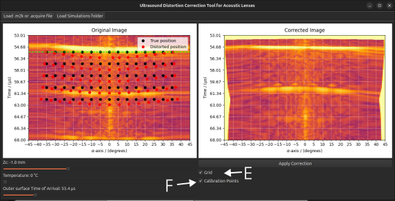

**A quick outline**

In ultrasound inspections using our proposed acoustic lenses [^1], one must assume a set of environmental conditions, such as the media propagation speed (which depends on temperature, for example), the lens-transducer relative position, the transducer-pipe relative position, etc. If any of these conditions is not met, the previously computed delay law yields a distorted imaging result. For instance, the banner image shows a simulation of a sectorial scan in cylindrical coordinates, where the delay law is computed assuming a different water-propagation speed and pipe position, resulting in a distorted reflector position (green cross).

In this project, we opted for a data-driven approach to correct the observed distortion. First, I simulated a set of calibration experiments in which a side-drilled hole would assume a grid-like pattern. In this experiment, we considered ideal conditions and non-ideal conditions. Using our spatial impulse response (SIR) simulator, we observed a mismatch between the two simulation scenarios, as shown in the left figure below. Then, we computed a [thin-plate spline (TPS) transform model](https://en.wikipedia.org/wiki/Thin_plate_spline) where the detected and assumed points serve as source and target. Since multiple sensors are available to measure environmental conditions, during a real-world inspection, the goal is to compute the TPS model from the current conditions. Then, with this model, apply the transform to the image, resulting in the correct output (the right side of the banner).

Below is a figure showing a graphical user interface (GUI) that I developed to make the correction process easier for the operator to apply.

[^1]: Pires, G. P., Kalid, T. E., Prado, T. D. A., Costa, V. L., Pereira, G. R., Passarin, T. A., & Pipa, D. R. (2025). An acoustic lens for displacement-free sectorial inspection of pipes with ultrasonic phased arrays. NDT & E International, 103459. 