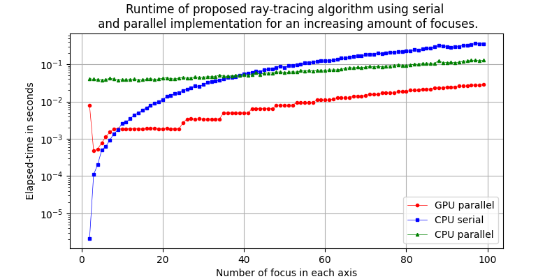

**A quick outline**

Most image reconstruction algorithms for ultrasound (US) data depend on knowing the time that the soundwave takes
to propagate from the source of the wave to a point in space, usually called Time Of Flight (TOF). When the source and
the point of interest, called focus, are in a single isotropic medium, the TOF is computed directly from the Euclidean distance 
between the transducer element and the imaging point. If, instead, there are multiple isotropic media, the TOF comes from the
path that obeys Snell's law. The problem of finding the path, or ray, is called the ray-tracing problem.

To compute the suitable ray for any arbitrarily shaped refraction profiles, there is no closed solution for this problem; thus, numerical methods 
have been proposed. Although they generally are fast to converge, when thousands of solutions are required--like when it is considered 
a transducer with a high amount of elements and a region of interest (ROI) with fine resolution--the problem becomes computationally intensive. 

To overcome this challenge, I implemented an algorithm proposed by [^1] for ultrasound ray-tracing for complex media in CPU and GPU parallel computing. Then I compared the results to those of serial computing. Overall, the results showed significant time improvements from GPU parallel computing after accounting for data transfer overhead. 

For the two isotropic media, a sine-like refraction profile, 64-element transducer, and a variable number, the speed-up is significant.

[^1]: Parrilla, M., Ibanez, A., Camacho, J., & Fritsch, C. (2007, April). Fast focal law computing for Non-Destructive Testing with phased arrays. In International Congress on Ultrasonics (pp. 1-4).